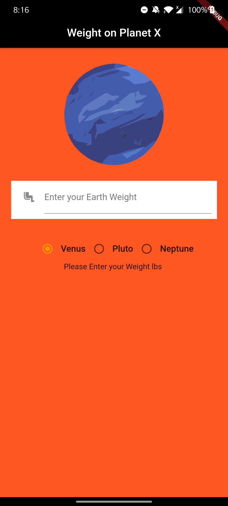
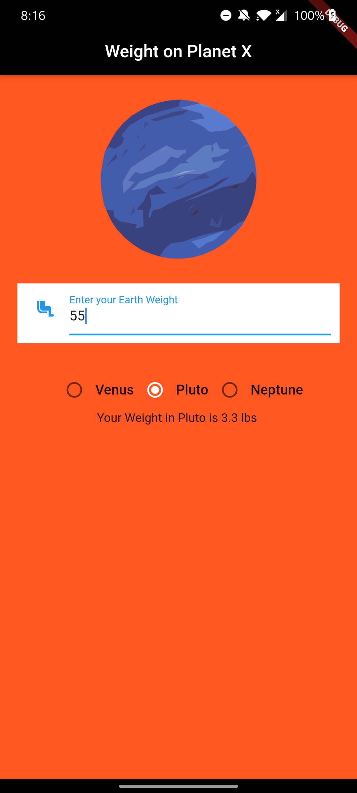
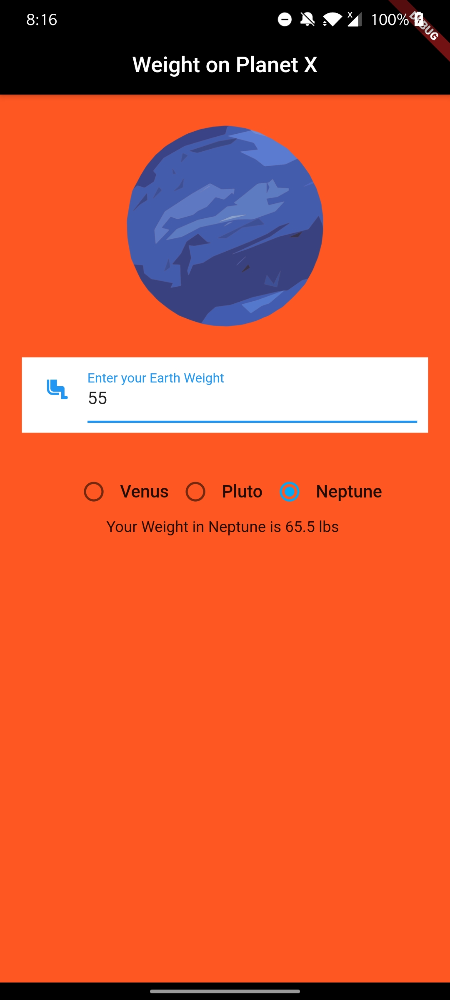
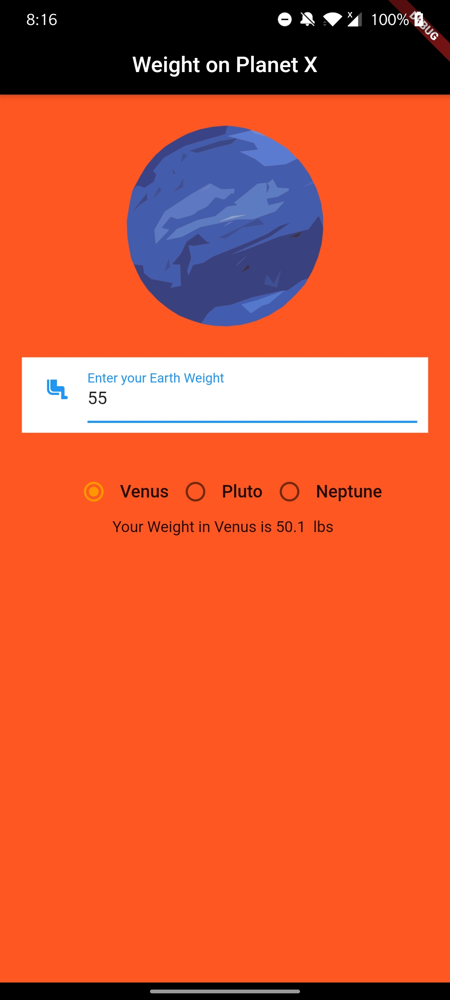

# WeightonPlanets-Flutter
This is a flutter app which tellls your weights on other planet.

### Note:
      -Initialize the flutter app and then paste the codes in lib directory.
  
      - For images to appear in app copy paste pubspec.yaml from the repository to your project. Voila ! Its done !

# The screenshots of the working app:

1.Initial View of App:

2.When entering weight in the Field:

3.Weight in Pluto:

4.Weight in Neptune:

5.Weight in Venus:

